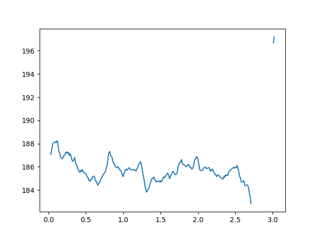

[](https://gitlab.tandav.me/pitchtrack/pitch-detectors/-/commits/master)

# pitch-detectors
collection of pitch (f0, fundamental frequency) detection algorithms with unified interface

## list of algorithms
<!-- table-start -->
| algorithm                                                                                                  | cpu   | gpu   | [MDBStemSynth](https://zenodo.org/record/1481172) accuracy   | [Mir1K](https://www.kaggle.com/datasets/datongmuyuyi/mir1k) accuracy   |
|------------------------------------------------------------------------------------------------------------|-------|-------|--------------------------------------------------------------|------------------------------------------------------------------------|
| [Crepe](https://github.com/marl/crepe)                                                                     | ✓     | ✓     | 0.886 ± 0.059                                                | 0.759 ± 0.073                                                          |
| [Penn](https://github.com/interactiveaudiolab/penn)                                                        | ✓     | ✓     | 0.699 ± 0.263                                                | 0.660 ± 0.090                                                          |
| [PipTrack](https://librosa.org/doc/latest/generated/librosa.piptrack.html)                                 | ✓     |       | 0.524 ± 0.286                                                | 0.864 ± 0.071                                                          |
| [PraatAC](https://parselmouth.readthedocs.io/en/stable/api_reference.html#parselmouth.Sound.to_pitch_ac)   | ✓     |       | 0.777 ± 0.302                                                | 0.859 ± 0.074                                                          |
| [PraatCC](https://parselmouth.readthedocs.io/en/stable/api_reference.html#parselmouth.Sound.to_pitch_cc)   | ✓     |       | 0.776 ± 0.300                                                | 0.872 ± 0.068                                                          |
| [PraatSHS](https://parselmouth.readthedocs.io/en/stable/api_reference.html#parselmouth.Sound.to_pitch_shs) | ✓     |       | 0.534 ± 0.238                                                | 0.578 ± 0.169                                                          |
| [Pyin](https://librosa.org/doc/latest/generated/librosa.pyin.html)                                         | ✓     |       | 0.722 ± 0.252                                                | 0.888 ± 0.047                                                          |
| [Rapt](https://pysptk.readthedocs.io/en/stable/generated/pysptk.sptk.rapt.html)                            | ✓     |       | 0.791 ± 0.282                                                | 0.827 ± 0.078                                                          |
| [Reaper](https://github.com/r9y9/pyreaper)                                                                 | ✓     |       | 0.792 ± 0.261                                                | 0.795 ± 0.083                                                          |
| [Spice](https://ai.googleblog.com/2019/11/spice-self-supervised-pitch-estimation.html)                     | ✓     | ✓     | 0.024 ± 0.034                                                | 0.889 ± 0.046                                                          |
| [Swipe](https://pysptk.readthedocs.io/en/stable/generated/pysptk.sptk.swipe.html)                          | ✓     |       | 0.784 ± 0.276                                                | 0.796 ± 0.062                                                          |
| [TorchCrepe](https://github.com/maxrmorrison/torchcrepe)                                                   | ✓     | ✓     | 0.764 ± 0.273                                                | 0.774 ± 0.084                                                          |
| [TorchYin](https://github.com/brentspell/torch-yin)                                                        | ✓     |       | 0.735 ± 0.268                                                | 0.866 ± 0.052                                                          |
| [World](https://github.com/JeremyCCHsu/Python-Wrapper-for-World-Vocoder)                                   | ✓     |       | 0.869 ± 0.135                                                | 0.842 ± 0.075                                                          |
| [Yaapt](http://bjbschmitt.github.io/AMFM_decompy/pYAAPT.html#amfm_decompy.pYAAPT.yaapt)                    | ✓     |       | 0.740 ± 0.271                                                | 0.744 ± 0.107                                                          |
| [Yin](https://librosa.org/doc/latest/generated/librosa.yin.html#librosa.yin)                               | ✓     |       | 0.749 ± 0.269                                                | 0.884 ± 0.043                                                          |
<!-- table-stop -->

accuracy is mean [raw pitch accuracy](http://craffel.github.io/mir_eval/#mir_eval.melody.raw_pitch_accuracy)

## install
```bash
pip install pitch-detectors
```

All agorithms tested on python3.12, this is recommended python version to use

## usage

```python
from scipy.io import wavfile
from pitch_detectors import algorithms
import matplotlib.pyplot as plt

fs, a = wavfile.read('data/b1a5da49d564a7341e7e1327aa3f229a.wav')
pitch = algorithms.Crepe(a, fs)
plt.plot(pitch.t, pitch.f0)
plt.show()
```


[Colab notebook with plots for all algorithms/models](https://colab.research.google.com/drive/1PVsk4ygDZIhIO3GEIukQJOKkgibqoG1n)


## additional features
- [ ] robust (vote + median) ensemble algorithm using all models
- [ ] json import/export

## notes:
Tests are running in subprocess (using `scripts/run_algorithm.py`) to avoid pytorch cuda import caching.
It's difficult to disable gpu after it has been initialized. (https://github.com/pytorch/pytorch/issues/9158)
It is also difficult to set correct PATH and LD_LIBRARY_PATH without a subprocess.
